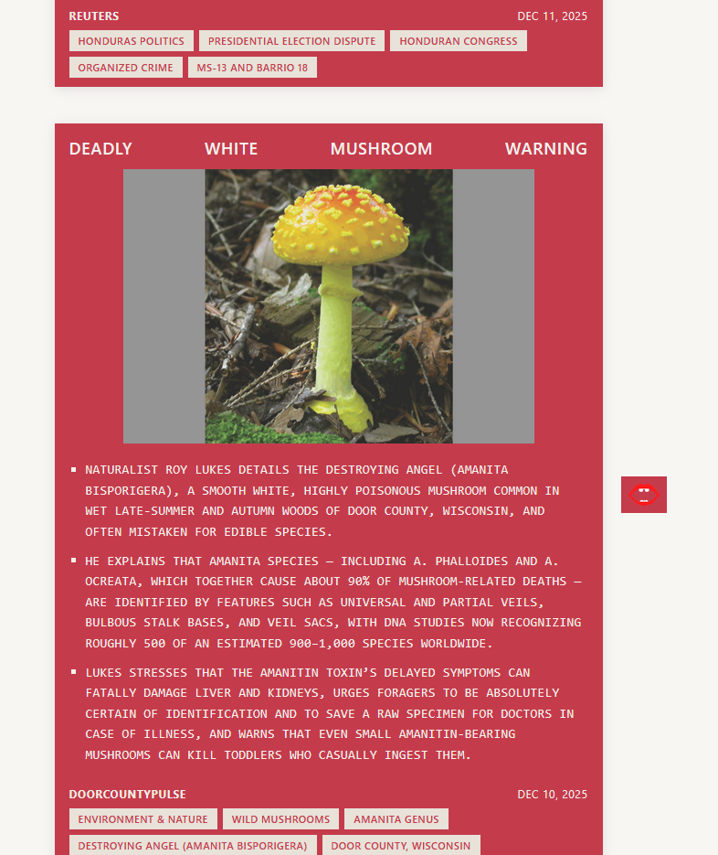

  
 
 
 
news<strong>CHOMP</strong> is a django app that condenses news. llm inference is used for the article summaries - paired with my curation bias it's not a reliable source of current events. its more of a form of disposable news entertainment with the side effect of staying informed. there are minimal sources right now as i implement them one a time :)
 
 
 
current sources:
 
 
 
world:
 
 
<em>apnews</em> 
<em>bbc</em> 
<em>reuters</em>
 
 
color:
 
 
<em>door county pulse</em> 
<em>urban milwaukee</em> 
<em>la taco</em> 
<em>st. louis magazine</em> 
<em>block club chicago</em> 
<em>the gothamist</em> 
<em>miami living</em> 
<em>303 magazine</em> 
<em>international examiner</em> 
<em>gambit</em> 
 

