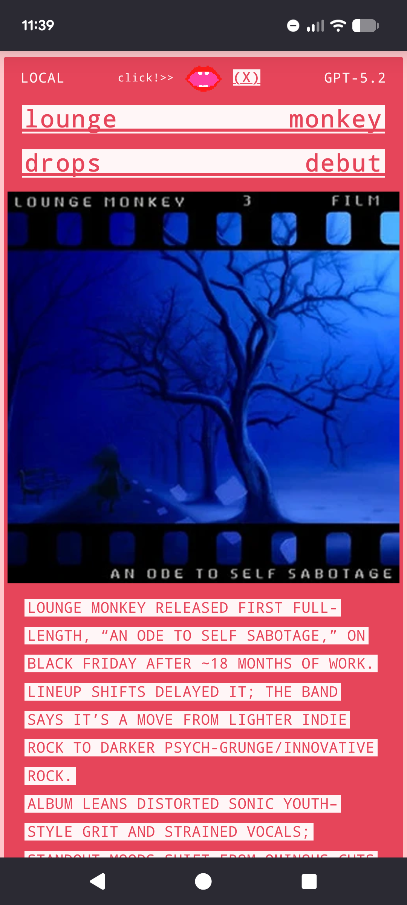
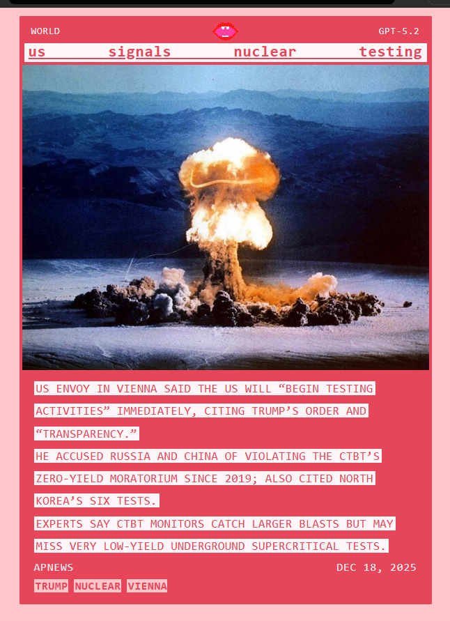

  
 
news<strong>CHOMP</strong> is a django app that condenses news articles. llm inference (openai gpt5.2) is used for the summaries - paired with my curation bias it's not a reliable source of current events. its more disposable news entertainment with the side effect of staying informed. there's minimal sources as i implement them one a time :)
 
 
current sources:
 
 
world:
 
<em>apnews</em> 
<em>bbc</em> 
<em>reuters</em>
 
 
local:
 
<em>door county pulse</em> 
<em>urban milwaukee</em> 
<em>st. louis magazine</em> 
<em>block club chicago</em> 
<em>the gothamist</em> 
<em>303 magazine</em> 
<em>international examiner</em> 
<em>gambit</em> 
<em>slug mag</em> 
<em>folio weekly</em> 
 
screenshots:
 
 

 

 

